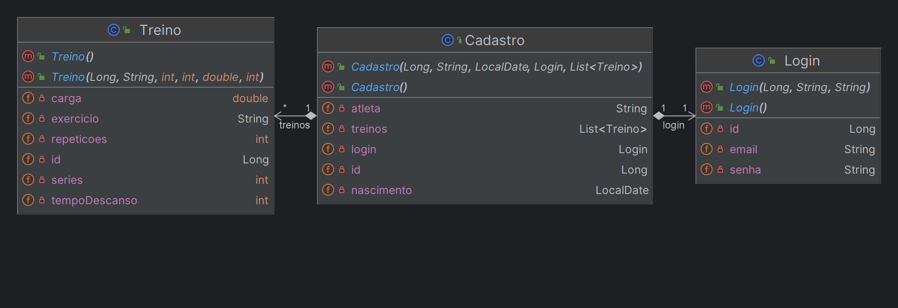
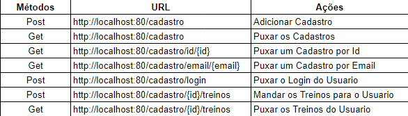

# GymBuddy

<h1>Nome dos Integrantes e Atividade Responsável - As entregas deveram ser realizadas até dia 20/05/2024</h1>

<ul>
  <li>Luigi Exposito Uchiyama - Responsável por fazer o projeto Java - Entregue no dia 17/05/2024 </li>
  <li>Henrique Oliveira Baptista - Responsável por fazer o projeto IA e Devops tools- Entregue no dia 18/05/2024 </li>
  <li>Igor Ribeiro Anccilotto - Responsável por fazer Compliance quality - Entregue no dia 18/05/2024 </li>
  <li>Pedro Henrique Endo de Oliveira - Responsável por fazer DataBase - Entregue no dia 18/05/2024 </li>
  <li>Kauane Almeida Gonçalves - Responsável por fazer Mobile e C# - Entregue no dia 18/05/2024 </li>
</ul>

<h1>Atualizações</h1>

Implementamos mudanças significativas em nosso projeto Java. Elevamos nosso código para o Modelo de Maturidade Nível 2, introduzimos a entidade 'Treinos' para acompanhar detalhes dos treinos dos usuários, renomeamos campos na entidade 'Cadastro' para maior clareza e adicionamos validações de restrição única para garantir a segurança dos dados. Essas melhorias refletem nosso compromisso com a qualidade e funcionalidade da plataforma.

<h1>Como rodar o projeto</h1>

Abra o Projeto no IntelliJ:
Abra o IntelliJ IDEA e abra o projeto Java no qual você deseja trabalhar. Você pode fazer isso selecionando a opção "File" (Arquivo) no menu superior e, em seguida, escolhendo "Open" (Abrir) para navegar até o diretório do projeto e selecioná-lo.

Configure as Configurações de Execução:
No canto superior direito da janela do IntelliJ, você verá uma lista suspensa de configurações de execução / depuração. Selecione ou adicione uma configuração de execução apropriada para sua aplicação. Se não houver uma configuração adequada, clique no menu suspenso e selecione "Edit Configurations" (Editar Configurações) para adicionar uma nova.

Defina a Classe Principal:
Na janela de configurações de execução, você verá uma opção para configurar a classe principal a ser executada. Selecione a classe principal da sua aplicação Java. Geralmente, essa é a classe que contém o método main.

Execute a Aplicação:
Após configurar as opções de execução conforme necessário, você pode executar sua aplicação Java clicando no botão "Run" (Executar) na barra de ferramentas superior ou pressionando Shift + F10. Isso compilará e executará sua aplicação usando as configurações especificadas.

Visualize a Saída:
Após a execução, você verá a saída da sua aplicação no console do IntelliJ. Certifique-se de verificar o console para quaisquer mensagens de erro ou saída relevante produzida pela sua aplicação.

Interaja com a Aplicação:
Dependendo da natureza da sua aplicação, você pode interagir com ela diretamente na interface do IntelliJ ou no console, conforme necessário.

Encerre a Execução:
Quando terminar de testar ou usar sua aplicação, você pode encerrar a execução clicando no botão "Stop" (Parar) na barra de ferramentas superior ou pressionando Ctrl + F2.

<h1>Diagramas</h1>

<h1>Link da ideia do Projeto</h1>

https://youtu.be/MvVYk-dFjNg

<h1>Endpoints</h1>

